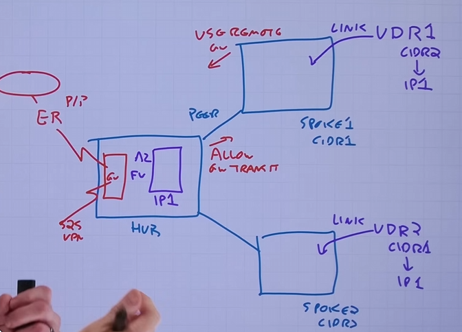
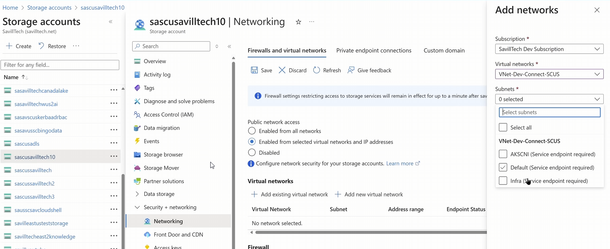

Vnet:
- exists in specific region
- exists in specific subscription
- IP subnets cannot overlap
> supports TCP, UDP
> ESP AND AH (IP SEC)
> ICMP (for diagonisics, like tracert commands, echo's, pings, etc)

Subscription > Region > Vnet (contains IP range aka CIDR, or multiple CIDR blocks)

NAT:
- sits on edge of Intranet and does all the translations for end devices when wanting to talk to the Internet (network address translation)

VMs:
- uses NIC for networking, can have several, or multiple configs per NIC (public ipv4, private ipv4, and 1 ipv6)
- NICs can be assigned to subnets within a vnet
- IP addresses can be dynamic (DHCP) or static, set in Az GUI (All ip's coming from Az)

External Access:
- provide secure internet access via NAT gateways, Az load balancers (be default, VMs cannot talk to internet)
> NAT gateways can be attached to subnets which then provide public IP's 
> Az load balancer with public IP in the front end config (it has to be public, not priv)
> VM NICS can have a public IP but not recommended for security
> Az firewall or network virtual applicance with a public IP (not efficient as other resources)

Connecting Vnets:
- multiple subs and/or regions means multiple vnets
- when 2 subnets want to talk to each other, it must route through the hub 
> you can use a s2s VPN to avoid this latency from the hub, but your stuck on the bandwidth of the VPN encryption

Best option:
- Vnet peering allows vnets to be connected via the MS backbone in same or diff regions
> ingress and egress charges
- you can peer to specific subnets too rather than the entire vnet

Scenario:
- you hava Hub and 2 spokes, the spokes can talk to the hub but not each other. Rather than manually creating those connections, you would use an Az Fw
> Az FW gets setup in the hub
> UDR (user defined routing) can be setup on the spokes to make it so traffic is sent to the Az FW (which has IP 1 as the default IP address) which then passes it to the correct spoke
- Az firewall talks to the gateways in the existing Vnet which can include things like a s2s VPN or Exp route to on-prem resources and once learned, those IP routes get sent back to the Az FW and it allows for an easier connection from services in the spokes to those on prem services

Connecting to on-prem:
- Many az services have external internet facing endpoints however private connectivity is required
> point to site VPN - connectes a specific device to a vnet (laptop to network)
> site to site VPN - connects a network to a vnet
> ExpressRoute private peering - connects a network to a vnet via peering location and ExpRoute gateway

VPNs:
- within a vnet you can setup a gateway subnet (for ex /27)
- here you have the options to set the VPN gateways (usually a pair) to Active / Passive or Active / Active
> its better to have A/A for resiliency and on the other end (on prem network) you would mimic this setup so if 1 fails, theres no downtime and the other gateway becomes ready to use
> better for smaller Orgs

Express Route:
- Within a vnet you can setup an ExpRoute gateway
- these gateways talk directly to MS owned pairs of routers at a 'meet me or peering point' 
- your on prem routers than talk to these meet me routers via your ISP
- you can see all the meet me locations on MS learn docs and where they are
> this is a paid option, you pay the ISP, MS for their routers at the meet me point, the ExpRoute gateways in your vnet, and all egress charges. These are also called circuits, tiers to this as well like basic offers up to 10 vnets can talk to each other in this circuit and prem is more vnets
- A circuit can house both active routers in the same building, so you want another circuit in a different building for resiliency 
- ExpRoute Metro is this but even better as the pair of routers can be in different buildings in the same city, providing more resiliency 
- ExpRoute global reach allows for multiple ExpRoute circuits (for multiple on prem networks) to use another circuit upon failure

Express Route Fastpath:
- a key component for private peering at the gateways that run in the vnet which have numberous functions:
> BGP (learning and exchanging routes and plumbing into the vnet)
> part of the data path from the MS edge endpoint (the MS backbone) at the peering location to the target resource
- removed the gateways as part of the data path enabling higher throughput 
- some features are limited or in preview

Controlling Traffic flows:
- be default traffic can freely flow with a vnet to any connected network
- to segment and control traffic with a vnet, between networks, and/or external you can do the following:
> Az fw or an network virtual appliance with traffic routed to it via UDR, here you can define rules for the traffic flow. Has different tiers with diff features.
> NSG's can be applied at the subnet or NIC level but always enforeced at the NIC. Must be in the same region and sub as the VM or resource it will be applied to.
- NSGs are made up of rules based on IP ranges/tags, ports and actions
- Service tags as the destination/source for NSG's, think like Az storage has many public IPS, MS allows you to just choose Storage as the service tag which will auto permit to any Az storage, can also limit to storage.US3 or storage.EU1 regions

Application Sec Groups:
- Basically like a tag
- has to be in the same region as VM or resouce you want to apply it to
- Ex, SQL VM's can be an ASG tag 

Az virtual WAN:
- provides a managed hub, removes headache of managing the hub youself
- each region within the vWAN instance gets a hub
- Secured hub also includes an Az Fw too
- 2 SKU's, basic and standard
> basic - S2S VPN only
> Std - S2S VPN, P2S VPN, ExpR, inter-hub, vNet transitive, etc.

Az Vnet Manager:
- Manually managing NSGs, routing, connecting, and more is difficult at scale
- AVNM enabled centralized mgmt of these aspects based on network groups, billed by number of netw groups it manages
> network group is a group of vnets, dynamically created or statically
- Uses something called connected groups (or mesh) which is explicit to AVNM and doesnt use peering
- use traditional hub and spoke which does use peering
> can add direct connect to add the connected group feature
- security admin rules
> similar to NSGs
> run before NSGs
> rather than allow/deny only, can toggle ALWAYS ALLOW to bypass NSGs too

Service endpoints and service endpoint policies: (FREE)
- NSGs are focused on traffic into and out of the vnet
- Many az PaaS offerings have their own Fw to lock down access
- it is often required to restrict a service to only specific subnets of a specific vnet (ex, storage acc 1 can only be accessed by Vnet2, subnet2 IP's)
- service endpoints make a specific subnet known to specific Az service and add optimal path to service
> you can attach a service endpoint to a particular subnet which will then allow this optimal route to the storage account 1 as per the example above
> these connections can then be configured within the storage account resource (or other resouces) OR you can manually enable this endpoint on the vnet itself

- you can use service endpoint policies to restrict access to only whats allowed
> SEP can be applied to a subnet with rules limiting access to certain resources which will then block anything else. Ex: Bad actor has access to storage acc 1 via subnet 2, they then try to copy data from SA1 to a new SA3 but this will be blocked as in the SEP we set it to only allow access from subnet 2 into SA1 and SA2, but nothing else.

Private Link: (PAID)
- when an externally facomg Azure PaaS service is accessed from a resource in a vnet the traffic stays on the Az network
- The PaaS service still has an external facing endpoint that some companies do not want even with firewall/auth lockdown
- Priv link enabled PaaS services to have a private endpoint for a service instance created in a vnet that is an avatar for that specific service instance
> ex, Storage acc 5 has by default has a public endpoint (IP), we want to turn that off completely. We create a priv endpoint which is just an IP address in the subnet where its created and talks directly to that SA5. Anything else in that subnet, and peering connections, can talk to this priv endpoint using the best route
> storageaccount5.blob.core.windows.net > resolved to the public IP (which we disabled above)
> priv link created an alias like SA5.privatelink.blob.core.windows.net 
- Private DNS zones link to private link and auto registers it in the zone which then links to a vnet. This way the DNS is correct. 
- The easy part is the priv link but the hard part is the DNS settings, since certificates wont directly match the priv link address it needs to be added to a priv DNS zone. Very complex for DNS -

DNS in Azure:
- vnets can use Az DNS or custom DNS
- Az DNS can provide public and private zones
- Private zone, you pick name and full mgmt of it
- vnets can be linked to priv DNS zones in addition the built in internal.cloudapp.net which is always there
- Az private DNS resolver:
> on-prem resouces may want to link to priv DNS zones in Az but it cant
> this provides a private IP that other DNS resolvers can use to then pass on to Az DNS'
> Az also uses an endpoint that it uses to talk to on prem resources that are placed on the vnet

